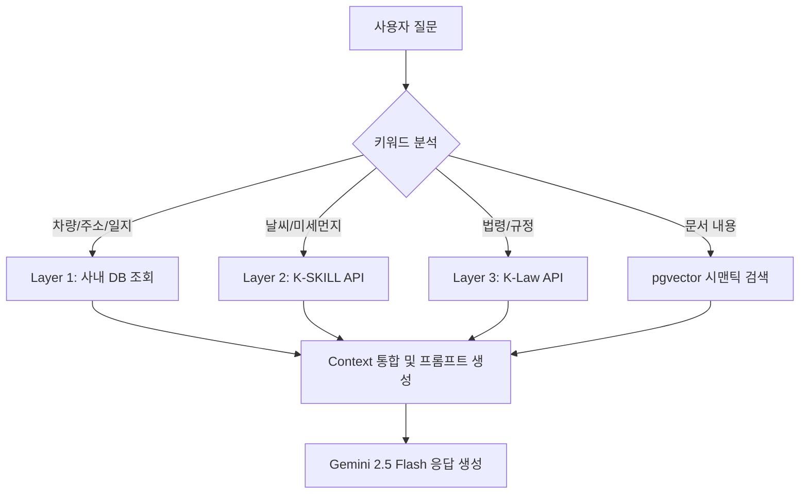

# 🚀 MASTER ARCHITECTURE (ELS Blueprint)

## 1. 시스템 개요
ELS Solution은 Next.js 프론트엔드와 Flask 백엔드, 그리고 독립적인 Selenium 봇 엔진으로 구성된 마이크로서비스 아키텍처입니다.

## 2. 주요 서비스 구성
### 2-1. Web (Next.js)
- **역할**: 사용자 UI, 대시보드, 업무 보고 시스템.
- **배포**: Vercel (elssolution.com)
- **특징**: App Router 기반의 빠른 응답성 및 PWA 지원.

### 2-2. Core API / NAS Backend (Flask)
- **역할**: NAS 파일 연동, 배차판 동기화, 로그 관리, 벡터 검색 API.
- **포트**: **2930**
- **특징**: `app.py`를 중심으로 24/7 백그라운드 스케줄링 수행.

### 2-3. Bot Engine (Selenium)
- **역할**: 외부 물류사(ETrans 등) 사이트 자동 데이터 수집 및 스크래핑.
- **포트**: **2931**

### 2-4. 아산지점 배차판 자동화 (Asan Dispatch)
- **데이터 소스**: NAS SMB 상의 `.xlsm` 엑셀 파일 (글로비스/모비스)
- **동기화 전략 (v5.5.9 지능형)**:
  - **Real-time (±7d)**: 파일 변경 감지 시 오늘 기준 전후 7일 데이터만 즉시 동기화 (NAS 부하 최소화).
  - **Daily Full (04:00)**: 매일 새벽 4시, 엑셀 내 모든 날짜 시트(2.2~미래) 전수 조사 및 DB 갱신.
- **기술 스택**: `Pandas` (데이터 처리), `openpyxl (read_only)` (메모리 최적화), `Supabase` (저장소)

---

## 3. 데이터베이스 설계 (Supabase)
- **`branch_dispatch`**: 전 지점 배차 데이터 통합 관리.
- **`user_activity_logs`**: 사용자 활동 및 자동화 시스템 로그 저장.
- **`document_chunks`**: RAG를 위한 벡터 인덱스 (WEB 게시판 첨부파일 전용, 768차원).
- **`ai_custom_rules`**: AI 영구 학습을 위한 사용자 피드백 저장소.

---

## 6. AI 어시스턴트 아키텍처 (Omni-Agent)

### 6-1. 3-Layer RAG 파이프라인

### 6-2. RAG 데이터 소스 상세
| 레이어 | 소스 | 트리거 | 반환 데이터 |
|---|---|---|---|
| **Omni-RAG** | Supabase DB | 모든 질문 | 연락처, 차량위치, 업무일지, 배차판 등 |
| **미세먼지** | K-SKILL Proxy | 날씨, 미세먼지 | AirKorea 공식 실시간 농도 |
| **유가 정보** | OPINET API | 경유, 유가, 기름값 | 전국 평균가 및 주간 변동 |
| **법률 정보** | K-Law API | 법, 규정, 과태료 | 법령 조문 및 판례 |
| **문서 검색** | pgvector (768d) | 항상 적용 | Web 게시판(S3) 첨부파일 의미론적 검색 (NAS 제외) |

### 6-3. 정확도 계층 및 유연 답변 원칙
- 🔴 **절대 정확 (Hallucination 금지)**: 안전운임, 사내 DB, 법령, 유가. (데이터 인용 필수)
- 🟡 **정확 우선**: 미세먼지, NAS 문서. (데이터 있으면 인용, 없으면 지식 기반 안내)
- 🟢 **유연 답변**: 상식, 날씨, 스포츠, 주식. (Gemini 일반지식 활용)

---

## 7. 관제 시스템 고도화 (Tracking Advanced)
### 7-1. 네비게이션 모드 (v5.11.3)
- **핵심**: 실시간 추적 시 `panTo` 기반의 부드러운 카메라 추적 기술 적용.
- **동적 마커 애니메이션**: `animateMarker` (easeOutCubic) 헬퍼를 통해 마커가 GPS 갱신 시 순간이동하지 않고 부드럽게 미끄러지듯 이동.
- **마커 재활용 (Map)**: 웹 관제 시 `Map<tripId, Marker>` 구조를 사용하여 데이터 갱신 시 발생하는 UI 깜빡임(Destruction/Re-creation) 근본적 차단.

### 7-2. 중앙 집중형 권한 통제 (v5.11.2)
- **정책**: 앱 기사의 지도 공개범위 설정을 제거하고, 웹 관리자 페이지(`driver-contacts`)에서만 통제 가능하도록 단일 진실 소스(Single Source of Truth) 일원화.
- **데이터 흐름**: `driver_contacts` 테이블의 `map_visibility` 필드 값을 기준으로 기사 앱의 지도 렌더링 범위(`own`/`contracted`/`all`) 결정.

---

## 8. 운영 가이드라인 (Operational Guardrails)
1. **APK 빌드**: 반드시 `scripts/build_driver_apk.ps1`을 경유해야 버전 자동화 및 웹 에셋 동기화가 보장됨. (수동 `cap sync` 금지)
2. **배포 정책**: 형(사용자)의 명시적 요청 시에만 `git push`를 수행하며, 모든 기술적 대화는 한국어로 진행.
3. **NAS 메모리**: 대형 엑셀 처리 시 `read_only` 모드와 `gc.collect()` 필수 유지.
4. **포트 관리**: Core(2930), Bot(2931) 포트 준수 (Docker 환경).

---

## 9. 비활성화 및 유산 페이지 (Legacy/Hidden Pages)
관리자 요청 또는 운영 정책에 따라 UI에서 제거되었으나, 코드는 유지 중인 페이지 목록입니다.
- **랜덤게임 (Random Game)**:
  - **경로**: `/employees/random-game`
  - **제거일**: 2026-04-23 (v5.5.16)
  - **사유**: 관리자 요청 (불필요한 기능 제거 및 업무 집중도 향상)
- **NAS 벡터화 스케줄러**:
  - **상태**: 비활성화 (v5.11.0)
  - **사유**: NAS 부하 경감 및 WEB 데이터 중심 RAG 재편.

---
*최종 갱신일: 2026-05-04 (by Antigravity | v5.11.3 Navigation Tracking Architecture)*