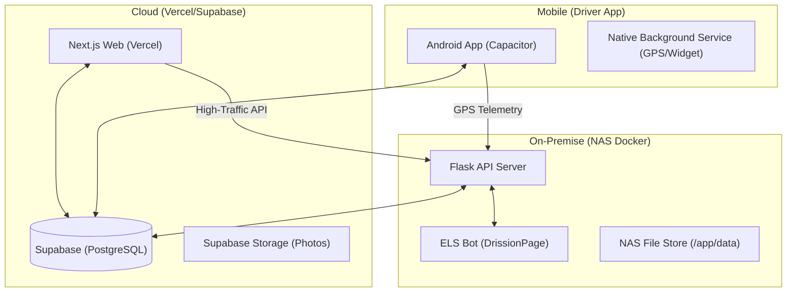

# 🗺️ ELS Solution 프로젝트 마스터 맵 (Architecture & Blueprint)

> **🚀 AI/IDE Quick Scan (Project Blueprint)**
> - **Core Stack**: Next.js 14 (App Router), Flask (Python 3.11), Capacitor 8.x, Selenium (DrissionPage).
> - **Primary Domains**: `nollae.com` (Vercel), `192.168.0.4:5000` (Internal NAS API), Supabase (PostgreSQL).
> - **Storage Mapping**: Cloud (Supabase Storage) + On-Premise (MinIO S3 / WebDAV).
> - **Build Requirements**: Node 18+, Python 3.11+, **Android SDK (Java 17 / Gradle 8.7.3)**.
> - **Critical Paths**: `/web` (Front), `/elsbot` (Selenium), `/docker/els-backend` (NAS API), `/web/android` (Native).
> - **Auth Flow**: Supabase Auth (OAuth) -> Server-side Session Management.

---

## 🏗️ 1. 전체 아키텍처 (High-Level Structure)

## 🏗️ 1. 전체 아키텍처 (High-Level Structure)

우리 프로젝트는 크게 **3개의 심장**으로 구성되어 유기적으로 연결됩니다.



---

## 📡 2. 핵심 연결 고리 (Connection Logic)

### 2-1. 웹 ↔ 나스 (API 리다이렉션)
- **목적**: Vercel의 CPU 서버리스 요금을 아끼고, 엑셀/파일 처리 등 무거운 작업을 나스에서 처리.
- **주요 채널**: `NEXT_PUBLIC_ELS_BACKEND_URL` (나스 IP:포트)를 통해 통신.
- **처리 항목**: 차량 실시간 관제(Polling), 활동 로그(Logging), 사진 프록시, 엑셀/ZIP 생성.

### 2-2. 앱 ↔ 나스 (실시간 관제)
- **목적**: 드라이버의 위치 정보를 3초(최대) 간격으로 나스에 전송하고, 관리자의 긴급 푸시(REALTIME_ON)를 수신.
- **주요 채널**: `HTTPS/HTTP` 요청 및 Supabase 실시간 알림 테이블 활용.

### 2-3. 나스 ↔ ETrans (봇 엔진)
- **목적**: 물류사(ETrans) 사이트에서 컨테이너 이력 데이터를 자동으로 긁어옴.
- **동작**: Flask 백엔드가 봇 데몬에게 명령을 내리면, 봇이 크롬을 띄워(Headless) 작업을 수행한 뒤 DB를 갱신.

### 2-4. 아산지점 배차판 자동화 (Asan Dispatch)
- **목적**: 매 전 지점 배차 현황을 실시간 자동 동기화.
- **동작**: 나스 백엔드(`app.py`)가 평일 06~23시 사이 30분 간격으로 파일 시스템을 스캔하여 Supabase를 갱신.

---

## 🛠️ 3. 환경별 필수 설치 리스트 (Tool Inventory)

### 💻 3-1. 개발 PC (Windows)
- **패키지 매니저**: [Scoop](https://scoop.sh/) (강력 권장)
- **필수 도구**: `git`, `nodejs-lts`, `python`, `ripgrep (rg)`, `fd`, `make`
- **에디터**: VS Code (Antigravity AI 연동)

### 🐋 3-2. NAS 서버 (Docker)
- **컨테이너**: `els-backend` (Flask + Chrome + Bot 통합 환경)
- **필수 바이너리**: Google Chrome 131, Chromedriver (경로: `/usr/bin/google-chrome`)
- **Python 의존성**: `DrissionPage`, `flask`, `supabase`, `pandas`, `openpyxl`

### 📱 3-3. 안드로이드 빌드 환경
- **프레임워크**: `Capacitor` (Web to Native 릴레이)
- **필수 API**: Android 14+ (Foreground Service Type 필수 선언)
- **권한 관리**: Location(Always), Overlay(위젯), Battery Optimization(제외)

---

## 📂 4. 주요 디렉토리 가이드 (Navigation Map)

- `/web`: Next.js 프론트엔드 코드 전반.
- `/docker/els-backend`: 나스에서 돌아가는 Flask API 서버 핵심 코드 (`app.py`, `Dockerfile`).
- `/elsbot`: 컨테이너 조회를 수행하는 봇 엔진 코드 (`els_bot.py`).
- `/web/android`: 안드로이드 네이티브 소스 및 Capacitor 설정.
- `/docs`: 프로젝트의 역사와 설계 문서 (`01_MISSION_CONTROL.md`가 최상위).

---

## 📱 5. 안드로이드 드라이버 앱 — JS 모듈 구조 (2026-04-05 리팩토링)

> `web/android/app/src/main/assets/public/` 기준.
> ES Modules (`type="module"`) 방식 적용. 빌드 도구 없음 — Capacitor WebView(Chrome 엔진)에서 네이티브 지원.

### 5-1. 모듈 의존성 다이어그램

```
[app.js] ← 엔트리 (window.App 조립 + init 호출)
    │
    ├── modules/store.js        ← 앱 상수(APP_VERSION, BASE_URL), Store, State
    ├── modules/bridge.js       ← Capacitor 플러그인, smartFetch, remoteLog  (← store)
    ├── modules/utils.js        ← formatDate, escHtml, showToast              (의존성 없음)
    ├── modules/nav.js          ← showScreen (순수 DOM)                        (의존성 없음)
    │
    ├── modules/permissions.js  ← 권한 관리, Android 16 가이드               (← store, bridge, nav)
    ├── modules/profile.js      ← 프로필 UI/저장/조회/사진                    (← store, bridge)
    │
    ├── modules/gps.js          ← GPS 추적, 실시간 모드, 상태 표시줄          (← store, bridge)
    ├── modules/trip.js         ← 운행 시작/종료/점검/오버레이                (← store, bridge, gps)
    │
    ├── modules/notice.js       ← 공지 목록/필터/상세                         (← store, bridge, utils)
    ├── modules/log.js          ← 일지 목록/상세/수정/사진                    (← store, bridge, utils, trip)
    ├── modules/photos.js       ← 업로드, 뷰어, 핀치줌                        (← store, bridge, utils, profile)
    │
    ├── modules/emergency.js    ← 긴급알림 폴링, SYSTEM_COMMAND               (← store, bridge, gps)
    ├── modules/update.js       ← APK 버전 체크                               (← store, bridge, utils)
    ├── modules/map.js          ← Static Maps 엔진, 터치/경로                 (← store, bridge, utils, nav)
    │
    └── modules/init.js         ← 앱 초기화, switchTab, showMain              (← 전체 모듈 조율)
```

### 5-2. 주요 설계 원칙

| 원칙 | 내용 |
|------|------|
| **단일 상태** | `State` 객체는 `store.js` 1곳에서만 정의. 모든 모듈이 같은 참조를 import하므로 뮤테이션 즉시 공유. |
| **순환 참조 방지** | `nav.js`를 별도 레이어로 분리. `permissions.js ↔ init.js` 양방향 의존은 `setupPermNav()` 콜백 주입으로 해소. |
| **크로스 모듈 호출** | 모듈 간 직접 import가 어려운 경우 `window.App.xxx()` 늦은 참조 사용 (런타임 시 window.App 완성 보장). |
| **빌드 스텝 없음** | Webpack/Vite 불필요. Capacitor WebView = Chrome → ES Module 네이티브 지원. |

### 5-3. Android APK 버전 관리 (4곳 동시 갱신 필수)
1. `web/android/app/build.gradle` — `versionCode`, `versionName`
2. `web/public/apk/version.json` — 자동 업데이트 알림용
3. `web/android/app/src/main/assets/public/modules/store.js` — `APP_VERSION`, `BUILD_CODE`
4. `web/android/app/src/main/assets/public/index.html` — `<span id="app-version-display">`

> ⚠️ 리팩토링 후 버전 상수 위치: `modules/store.js` (기존 `app.js` 상단에서 이동됨)

---

## 🚨 5. 운영 시 주의사항 (Operational Guardrails)

1. **봇 로그인**: ETrans 사이트는 세션이 민감하므로, 봇이 작업 중일 때는 수동 로그인을 자제해야 합니다.
2. **트래픽 오프로딩**: 프론트엔드(`web/`) 수정 시 모든 API 주소 앞에 `baseUrl` 정합성을 반드시 체크하십시오. (PDCA/TDD 필수!)
3. **나스 빌드**: `Dockerfile` 수정 후에는 반드시 `sh scripts/nas-deploy.sh`로 전체 컨테이너를 다시 구워야 합니다. (약 40분 소요)

---
*최종 갱신일: 2026-04-02 (by Antigravity v4.4.40)*
