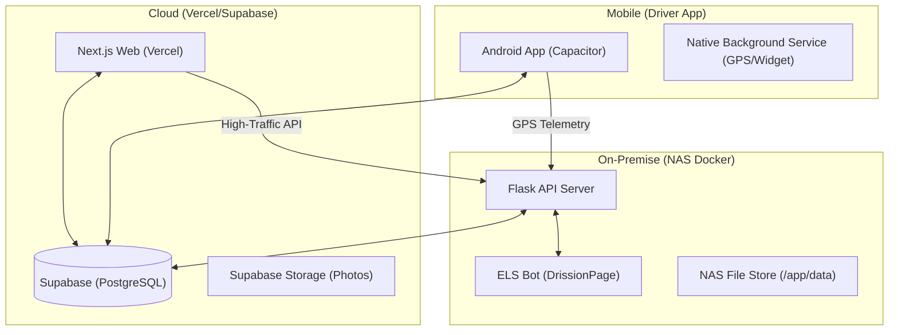

# 🗺️ ELS Solution 프로젝트 마스터 맵 (Architecture & Roadmap)

이 문서는 ELS Solution 프로젝트의 전체 구조, 기술 스택, 그리고 각 컴포넌트 간의 연결 고리를 총망라한 **중앙 제어 설명서**입니다.

---

## 🏗️ 1. 전체 아키텍처 (High-Level Structure)

우리 프로젝트는 크게 **3개의 심장**으로 구성되어 유기적으로 연결됩니다.

---

## 📡 2. 핵심 연결 고리 (Connection Logic)

### 2-1. 웹 ↔ 나스 (API 리다이렉션)
- **목적**: Vercel의 CPU 서버리스 요금을 아끼고, 엑셀/파일 처리 등 무거운 작업을 나스에서 처리.
- **주요 채널**: `NEXT_PUBLIC_ELS_BACKEND_URL` (나스 IP:포트)를 통해 통신.
- **처리 항목**: 차량 실시간 관제(Polling), 활동 로그(Logging), 사진 프록시, 엑셀/ZIP 생성.

### 2-2. 앱 ↔ 나스 (실시간 관제)
- **목적**: 드라이버의 위치 정보를 3초(최대) 간격으로 나스에 전송하고, 관리자의 긴급 푸시(REALTIME_ON)를 수신.
- **주요 채널**: `HTTPS/HTTP` 요청 및 Supabase 실시간 알림 테이블 활용.

### 2-3. 나스 ↔ ETrans (봇 엔진)
- **목적**: 물류사(ETrans) 사이트에서 컨테이너 이력 데이터를 자동으로 긁어옴.
- **동작**: Flask 백엔드가 봇 데몬에게 명령을 내리면, 봇이 크롬을 띄워(Headless) 작업을 수행한 뒤 DB를 갱신.

---

## 🛠️ 3. 환경별 필수 설치 리스트 (Tool Inventory)

### 💻 3-1. 개발 PC (Windows)
- **패키지 매니저**: [Scoop](https://scoop.sh/) (강력 권장)
- **필수 도구**: `git`, `nodejs-lts`, `python`, `ripgrep (rg)`, `fd`, `make`
- **에디터**: VS Code (Antigravity AI 연동)

### 🐋 3-2. NAS 서버 (Docker)
- **컨테이너**: `els-backend` (Flask + Chrome + Bot 통합 환경)
- **필수 바이너리**: Google Chrome 131, Chromedriver (경로: `/usr/bin/google-chrome`)
- **Python 의존성**: `DrissionPage`, `flask`, `supabase`, `pandas`, `openpyxl`

### 📱 3-3. 안드로이드 빌드 환경
- **프레임워크**: `Capacitor` (Web to Native 릴레이)
- **필수 API**: Android 14+ (Foreground Service Type 필수 선언)
- **권한 관리**: Location(Always), Overlay(위젯), Battery Optimization(제외)

---

## 📂 4. 주요 디렉토리 가이드 (Navigation Map)

- `/web`: Next.js 프론트엔드 코드 전반.
- `/docker/els-backend`: 나스에서 돌아가는 Flask API 서버 핵심 코드 (`app.py`, `Dockerfile`).
- `/elsbot`: 컨테이너 조회를 수행하는 봇 엔진 코드 (`els_bot.py`).
- `/web/android`: 안드로이드 네이티브 소스 및 Capacitor 설정.
- `/docs`: 프로젝트의 역사와 설계 문서 (`01_MISSION_CONTROL.md`가 최상위).

---

## 🚨 5. 운영 시 주의사항 (Operational Guardrails)

1. **봇 로그인**: ETrans 사이트는 세션이 민감하므로, 봇이 작업 중일 때는 수동 로그인을 자제해야 합니다.
2. **트래픽 오프로딩**: 프론트엔드(`web/`) 수정 시 모든 API 주소 앞에 `baseUrl` 정합성을 반드시 체크하십시오. (PDCA/TDD 필수!)
3. **나스 빌드**: `Dockerfile` 수정 후에는 반드시 `sh scripts/nas-deploy.sh`로 전체 컨테이너를 다시 구워야 합니다. (약 40분 소요)

---
*최종 갱신일: 2026-04-01 (by Antigravity)*
